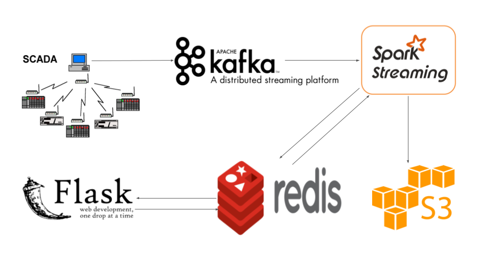

# Downtime Estimator

Downtime means different things in different industries. But fundamentally, downtime can be described as the time between shut-down and start-up of crucial operations. Downtime may also be described as a period of time within which the processes that make money for the company have to be put on hold for inevitable reasons. In anycase, the ability to estimate downtime aids the minimization of financial losses due to downtime.

The business case that inspired the development of this tool is downtime estimation during oil production. Partucularly, wells that use artificial lift pumps such as beam pumps or sucker-rod pumps need to be shutdown when fluid levels drops below a certain allowable threshold in a wellbore. As fluid levels rise due to fluid influx from the reservoir, beam pumps are used to produce the oil in the wellbore and this process result in a drop in fluid level over time. The pumps are shutdown intermittently in order to prevent pump damage. 

Sensor data from pumps and pattern recognition are used to determine when a pump should be shutdown. The same pump data is no longer available once the pump has been shutdown. However, pump metadata indicating when the pump was shutdown, started-up and how much was produced in the time period the pump was running remains available. While the pump is off, valuable oil production is halted. The ability to estimate the amount of time it will take for the fluid level in the wellbore to rise above an acceptable threshold above the pumps can be turned on and oil production can commence is crucial. 

Our goal was to develop a data-driven methodology for estimating production downtown. The following is the outline explains the components of the downtime estimator.

1. [Stream Data Generation](README.md#stream-data-generation)
2. [Data Ingestion using Kafka](README.md#data-ingestion-using-kafka)
3. [Distributed Computing using Spark](README.md#distributed-computing-using-spark)
4. [Data Storage using Redis Cache](README.md#data-storage-using-redis-cache)
5. [The Pipeline](README.md#the-pipeline)
6. [Demo](README.md#demo)
7. [Setup Steps](README.md#setup-steps)
8. [FAQ](README.md#faq)

## Stream Data Generation
Data was generated to simulate pump metadata (state-change data). The data includes well ID, event timestamp, event type (shutdown or startup), production volume at shutdown, well completion info., wellbore volume, field, well lat-lng, state. Typically, this information would be collected on scada systems that house operation data. 

## Data Ingestion using Kafka
Data ingestion for the data stream was published on a distributed kafka cluster on AWS ec2 (an elastic cloud computing platform). The event-producer.py script generates the pump metadata and sends them to the kafka queue.

## Distributed Computing using Spark
Consumption of the data from the kafka queue and distibuted computing is being conducted using spark-streaming session, which is a micro-batching module in the pyspark library. Computations are distributed on four ec2 nodes (1 master and 3 workers). Zookeeper and spark were installed on these nodes using pegasus (which is a VM based deployment tool for prototyping other Big Data tools on Amazon Web Services). The event-consumer.py script is the pyspark code that consumes the data from the kafka queue and processes them real-time in a distributed manner. This code also saves the original data to AWS S3, which is a highly scalable data repository.The same code also saved processed data result and recent history well parameters into redis, which is an memory cache key-value store. 

## Data Storage using Redis Cache
The result of the computation along with recent history information is being stored in redis real-time. This is stored on a replicated node cluster (1 master, 1 slave). The reason for this is to prevent data loss in case of node failures. 

## The Pipeline
|  | 
|:--:| 
| *Figure 1: A real-time streaming and processing data pipeline for downtime estimation* |

## Demo

## Setup Steps
Coming soon!

## FAQ
Coming soon!

